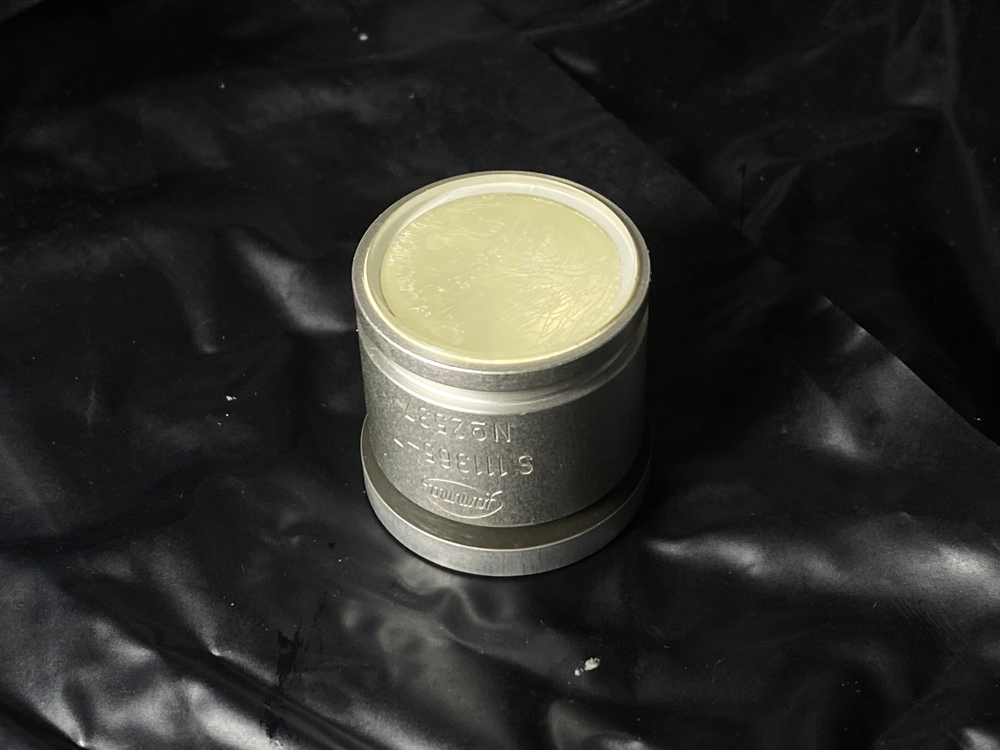
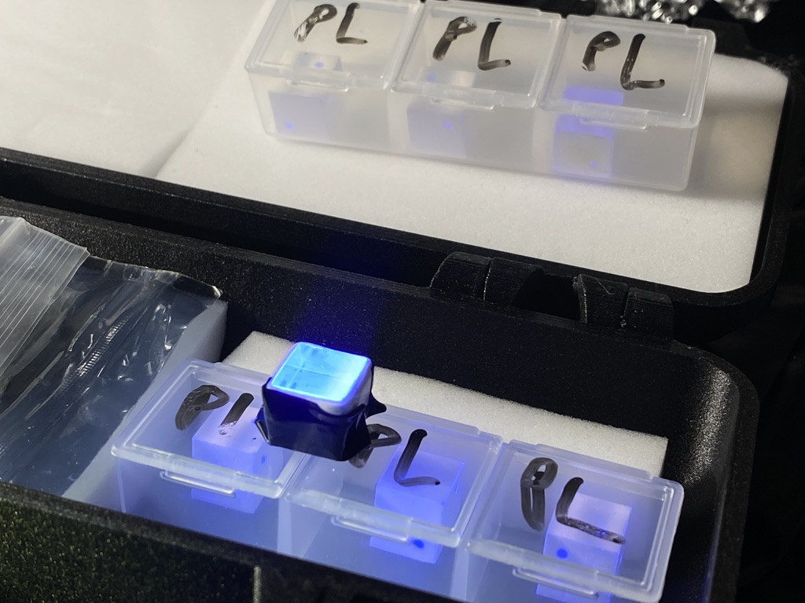
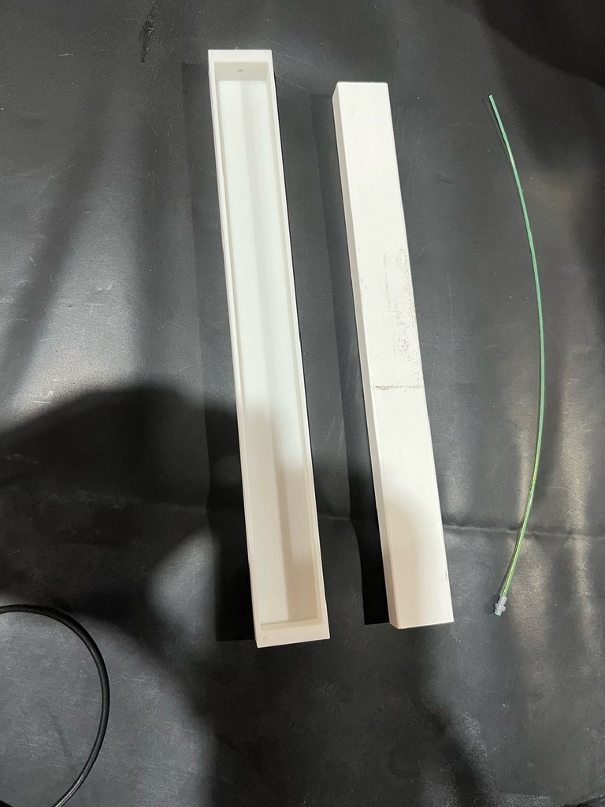

## **1. Introduction**  
Scintillation detectors play a foundational role in modern experimental nuclear physics and radiation monitoring. The operating principle of these devices is based on the phenomenon of luminescence: when ionizing radiation (such as gamma rays, alpha particles, beta particles, or muons) interacts with the scintillation material, the absorbed energy excites atoms, which subsequently release energy in the form of photons (typically in the visible or ultraviolet range).

This faint light signal is then collected and amplified by photodetectors, such as traditional Photomultiplier Tubes (PMTs) or emerging semiconductor technologies like Silicon Photomultipliers (SiPMs), converting it into an electrical signal for amplitude and timing analysis.

Within the framework of this research, we focus on characterizing and optimizing the performance of scintillation detector systems for the following applications:
- Radioactive source detection and dosimetry.
- Gamma-ray energy spectroscopy.
- Cosmic ray observation.
Our current research delves into comparing light yield, analyzing pulse shapes, and evaluating the practical applicability of three distinct types of scintillation materials: inorganic crystals (NaI(Tl), BGO) and organic plastics (Plastic Scintillator).
## **2. Detail information Plastic Scintillator**  
The laboratory currently operates three main types of scintillation detectors, selected for different measurement purposes:

The laboratory currently operates three main types of scintillation detectors, selected for different measurement purposes:

### **NaI(Tl) Detector** 
- Sodium Iodide doped with Thallium provides a **high light yield ($\sim 38,000\,  photons/MeV$)** and emits light with a **peak wavelength around $415 \, nm$**.
- This is our NaI(TI) scintillator, which size is **1 inch**
    
    

### **BGO Detector** 
- Bismuth Germanate has a **moderate light yield (~8,000–9,000 photons/MeV)** and emits at a **peak wavelength of about 480 nm**.  With its high density (**7.13 g/cm³**).
- Section of this BGO is : $4.5 \, mm^2$
    ![[EE6350A6-78F8-4CE7-BD72-2F15A22E9474_1_105_c.jpeg]]
### **Plastic Scintillator**
- Based on polyvinyltoluene or polystyrene, it provides a **light yield of approximately 10,000 photons/MeV** with an emission **peak near 420 nm** and a **decay time of a few nanoseconds**.  
- Plastic scintillator we have 2 type : 
	- Cube type with volumn is $1\, cm^3$
	- Rod bar type with size is $25 \, cm \times 2.3 \, cm \times 1.3 \, cm$

<figure>  <figcaption>Cube type </figcaption> </figure>
<figure>  <figcaption>rod bar type</figcaption> </figure>

## Setup
### NaI(TI) Detector, BGO, Plastic (cube type)
In here we setup the scintillator directly optically coupled to the SiPM to maximize light collection efficiency and minimize signal loss, as illustrated in figure bellow.
![[Pasted image 20251205140913.png]]
### Plastic (rod bar)
large-area plastic scintillator bars, we utilize a 0.9 mm diameter optical fiber to collect and guide the photon signal to the SiPM, as illustrated in figure below.
![[Pasted image 20251205141546.png]]
